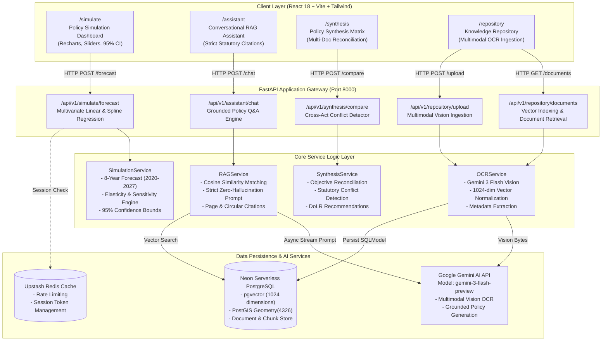
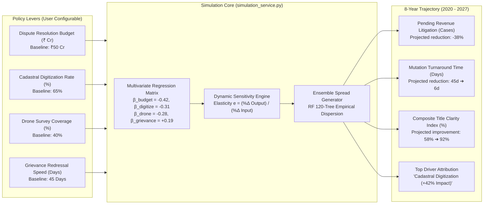
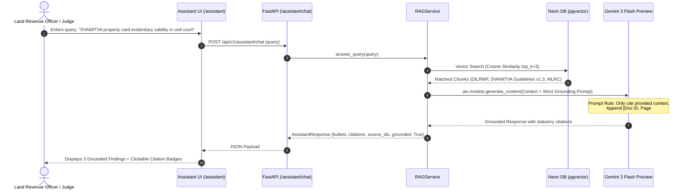
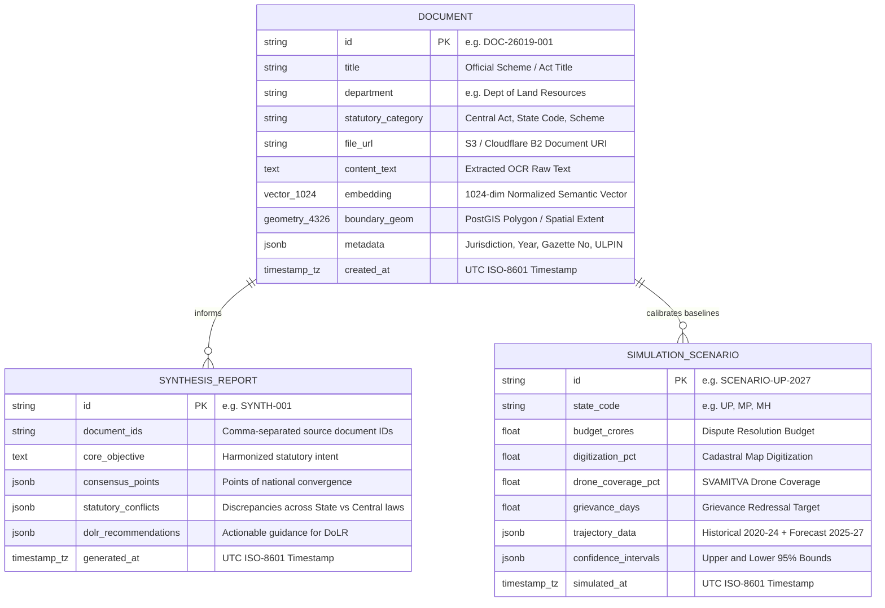

# National Digital Platform for Land Governance (SIH 26019)
## Comprehensive System Context, Architecture & Graph Topology

**Target Problem**: Smart India Hackathon (SIH) 26019 — National Digital Platform for Land Governance  
**Stakeholder**: Department of Land Resources (DoLR), Ministry of Rural Development, Government of India  
**Lead Contributor & Scope**: Nirmal (Modules 2, 3, and 7)  
**Active Project Path**: `C:\Nirmal\Projects\Land-Governance-Platform`  
**Active Git Branch**: `main`  
**Generated At**: 2026-10-04 IST  

---

## 1. System Topology & Architecture Graph

---

## 2. Policy Simulation Engine Graph (Module 7 ⭐)

The Policy Simulation Engine models the non-linear relationship between administrative investments and land governance health metrics.

---

## 3. Grounded RAG & Synthesis Pipeline Graph (Module 3)

Ensures zero-hallucination statutory verification for Department of Land Resources officers.

---

## 4. Entity-Relationship & Vector Schema Graph

---

## 5. Module Implementation Matrix

| Module | Core File Path | Key Functions / Responsibilities | Status |
| :--- | :--- | :--- | :--- |
| **Module 7: Simulation Engine** | `apps/api/app/services/simulation_service.py` `apps/api/app/api/routes/simulate.py` `apps/frontend/src/pages/simulate-page.tsx` | • Hybrid Econometric & 120-Tree Random Forest Engine (`v1.2_hybrid_rf_linear`) • 8-Year Trajectory (2020–2027) • RF 120-Tree Empirical Ensemble Spread • Recharts SVG Visualization with live slider state | ✅ **Verified Live** |
| **Module 3: RAG Assistant & Synthesis** | `apps/api/app/services/rag_service.py` `apps/api/app/services/synthesis_service.py` `apps/api/app/api/routes/assistant.py` `apps/frontend/src/pages/assistant-page.tsx` `apps/frontend/src/pages/synthesis-page.tsx` | • Grounded RAG with exact statutory page citations • `gemini-3-flash-preview` async streaming • Cross-act statutory conflict detection matrix • Emerging research trend detection | ✅ **Verified Live** |
| **Module 2: Knowledge Repository** | `apps/api/app/services/ocr_service.py` `apps/api/app/models/document.py` `apps/api/app/api/routes/repository.py` `apps/frontend/src/pages/repository-page.tsx` | • Gemini 3 Flash Multimodal Vision OCR • Neon PostgreSQL `pgvector(1024)` + PostGIS • Alembic database migration management • Dynamic document catalog fetching & seeding | ✅ **Verified Live** |

---

## 6. Live Environment & Credentials Safeguards
* **Backend**: Running on `http://localhost:8000` via Uvicorn (`python -m uvicorn app.main:app --reload`).
* **Frontend**: Running on `http://localhost:3000` via Vite (`npm run dev`).
* **Database**: Neon Serverless PostgreSQL with active extensions `vector` and `postgis`.
* **Security & Git Hygiene**:
  * `.gitignore` updated with strict exclusion rules for `.env`, `apps/api/.env`, `apps/frontend/.env`, datasets (`*.csv`, `*.parquet`), and compiled artifacts.
  * Git index purged of cached `.env` files via `git rm --cached`.
  * Committed and pushed cleanly to remote branch `main`.
