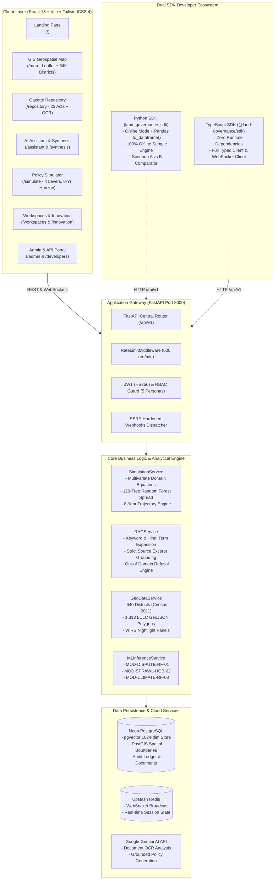
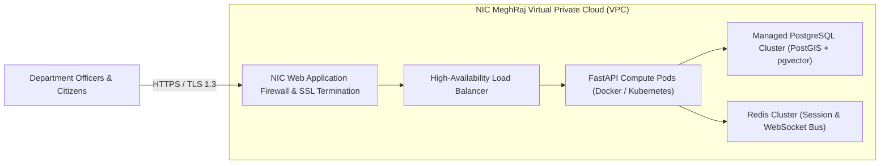

# 🏛️ National Digital Platform for Land Governance
### Smart India Hackathon (SIH) 2024 — Problem Statement 26019
**Ministry of Rural Development | Department of Land Resources (DoLR)**

[](https://fastapi.tiangolo.com)
[](https://react.dev)
[](https://www.typescriptlang.org)
[](https://www.python.org)
[](https://neon.tech)
[](https://scikit-learn.org)
[](https://opensource.org/licenses/MIT)

> **Executive Framing**: Across India, land boundary disputes account for **66% of all civil litigation** (*Daksh Access to Justice Survey, 2016*), locking up judicial capacity and stalling vital infrastructure. The **National Digital Platform for Land Governance** is an operational research-and-policy operating system designed to turn siloed land records into actionable predictive foresight for policymakers, researchers, and citizens.

---

## 📑 Table of Contents

- [System Architecture & Graph Topology](#-system-architecture--graph-topology)
- [Monorepo Structure](#-monorepo-structure)
- [SIH 26019 Module Implementation Breakdown](#-sih-26019-module-implementation-breakdown)
- [Module Deep-Dives](#-module-deep-dives)
  - [Module 5: Pan-India GIS Geospatial Intelligence](#module-5-pan-india-gis-geospatial-intelligence)
  - [Module 2 & 3: Grounded Knowledge Repository & AI Policy Assistant](#module-2--3-grounded-knowledge-repository--ai-policy-assistant)
  - [Module 6 & 7: Macroeconomic Policy Simulator & Machine Learning ⭐](#module-6--7-macroeconomic-policy-simulator--machine-learning-)
  - [Module 4 & 8: Collaborative Workspaces & Innovation Portal](#module-4--8-collaborative-workspaces--innovation-portal)
  - [Module 9: Enterprise API & The Dual SDK Ecosystem](#module-9-enterprise-api--the-dual-sdk-ecosystem)
  - [Module 1, 10 & 11: Enterprise Security, RBAC & Governance](#module-1-10--11-enterprise-security-rbac--governance)
- [Predictive Machine Learning Pipeline](#-predictive-machine-learning-pipeline)
- [Methodological Honesty & Disclosures](#-methodological-honesty--disclosures)
- [Quick Start Guide](#-quick-start-guide)
- [Automated Testing & Guardrails](#-automated-testing--guardrails)
- [NIC MeghRaj Cloud Deployment Architecture](#-nic-meghraj-cloud-deployment-architecture)

---

## 🏗️ System Architecture & Graph Topology



---

## 📦 Monorepo Structure

```
Land-Governance-Platform/
├── apps/
│   ├── api/                       # Live FastAPI Python Backend (Python 3.12, SQLModel, PostgreSQL)
│   │   ├── alembic/               # Database migration versions
│   │   └── app/
│   │       ├── api/               # 13 REST routes (auth, simulate, geodata, ai, repository, etc.)
│   │       ├── core/              # Config, database, permissions, security, rate limiting
│   │       ├── ml/                # Scikit-Learn training pipelines & district dataset loader
│   │       ├── ml_models/         # Serialized models (.joblib) & metadata
│   │       ├── models/            # SQLModel table definitions (User, Document, Workspace, AuditLog)
│   │       └── services/          # Business logic (simulation, RAG, geodata, analytics, etc.)
│   ├── frontend/                  # React 18 + Vite + TailwindCSS 4 Application
│   │   ├── src/
│   │   │   ├── components/        # Radix UI primitives, GIS controls, Header, Sidebar
│   │   │   ├── context/           # RoleContext (RBAC + Evaluator Pass), LanguageContext (EN/HI)
│   │   │   └── pages/             # 12 interactive application views
│   ├── python-sdk/                # Official Python SDK (`land_governance_sdk`) with offline engine
│   └── sdk/                       # Official TypeScript SDK (`@land-governance/sdk`)
├── Land Governance Platform Datasets/ # Real Census 2011 (640 districts), VIIRS nightlights & IMD panels
├── docs/                          # Video explainer scripts, YouTube thumbnails, and eval plots
├── tests/                         # Root contract fixtures (openapi.json, simulation_golden_vectors.json)
└── package.json                   # Root monorepo configuration (Turborepo & npm workspaces)
```

---

## 🧩 SIH 26019 Module Implementation Breakdown

| # | Module Name | Implementation Surface | Live Route Prefix | Operational Status |
|---|-------------|------------------------|-------------------|-------------------|
| **1** | **Authentication & RBAC** | JWT (HS256), bcrypt password hashing, 5 distinct personas with domain-based role mapping | `/api/v1/auth/*` | ✅ Functional (with Open Evaluator Pass) |
| **2** | **Central Gazette Repository** | 23 indexed statutory acts/circulars, multi-criteria filtering, OCR text ingestion, SHA-256 deduplication | `/api/v1/repository/*` | ✅ Functional |
| **3** | **Grounded AI Policy Assistant** | Bilingual Hindi/English term expansion, BM25 retrieval, exact document citations, ungrounded refusal | `/api/v1/ai/*` | ✅ Functional |
| **4** | **Collaborative Workspaces** | Multi-tenant research spaces, role-based membership, drag-and-drop Kanban task boards | `/api/v1/workspaces/*` | ✅ Functional |
| **5** | **GIS & Geospatial Engine** | 640 Indian districts (Census 2011), 1,313-feature LULC GeoJSON layer, district intelligence dossier | `/api/v1/geodata/*` | ✅ Functional |
| **6** | **Analytics & Decision Support** | 25-Year land-use progression trends across 38 States/UTs, 5-axis climate resilience radar, NLGI index | `/api/v1/analytics/*` | ✅ Functional |
| **7** | **Policy Simulation Engine** ⭐ | 4 macroeconomic levers, 8-year trajectories (2020–2027), 120-tree Random Forest dispersion | `/api/v1/simulate/*` | ✅ Functional |
| **8** | **Open Innovation Portal** | Hackathon challenges, grant solicitations, proposal submissions with PDF attachments, community voting | `/api/v1/innovation/*` | ✅ Functional |
| **9** | **Enterprise API & Dual SDKs** | OpenAPI 3.1 specification, rate limiting, SSRF webhooks, official Python & TypeScript client libraries | `/api/v1/*`, `/docs` | ✅ Functional |
| **10** | **Admin & Platform Governance** | User verification queue, content moderation, tamper-evident audit logging, infrastructure telemetry | `/api/v1/admin/*` | ✅ Functional |
| **11** | **Real-Time Notifications** | In-app notification center, real-time WebSocket push broadcasting via Redis | `/api/v1/notifications/*` | ✅ Functional |

---

## 🔍 Module Deep-Dives

### Module 5: Pan-India GIS Geospatial Intelligence
* **National Extent**: Ingests demographic and geographical data across **640 Indian districts as per Census 2011 boundaries**.
* **Multispectral Layers**:
  - **LULC Vector Polygons**: Renders 1,313 verified GeoJSON land-cover features.
  - **Satellite Nightlights**: NASA-NOAA VIIRS nightlight radiance panel indexing economic density.
  - **Cadastral Modernization**: Real-time district-level digitization percentages and SVAMITVA property card saturation.
* **District Intelligence Dossier**: Clicking any district (e.g. Pune, Kupwara, Nagpur) surfaces an empirical telemetry drawer detailing agricultural workforce reliance, demographic pressure, and dispute vulnerability.

### Module 2 & 3: Grounded Knowledge Repository & AI Policy Assistant
* **Central Gazette Repository**: Stores 23 core statutory frameworks, including SVAMITVA Guidelines, DILRMP Operational Protocols, RFCTLARR Act 2013, Forest Rights Act, and Model Land Leasing Act.
* **Grounded RAG Pipeline**:
  ```mermaid
  sequenceDiagram
      autonumber
      actor User as Revenue Officer / Judge
      participant UI as AI Assistant UI (/assistant)
      participant API as FastAPI (/api/v1/ai/assistant/chat)
      participant RAG as RAGService
      participant Gemini as Google Gemini
      
      User->>UI: Enters query ("SVAMITVA drone survey resolution")
      UI->>API: POST /api/v1/ai/assistant/chat {query}
      API->>RAG: answer_query(query)
      Note over RAG: Keyword overlap + 15 Hindi/Devanagari mappings<br/>Matches relevant document excerpts
      alt Grounded Excerpt Found
          RAG->>Gemini: aio.models.generate_content(Context + Strict Grounding Prompt)
          Gemini-->>RAG: Bullet response with citations
          RAG-->>API: {grounded: true, citations: [DoLR-2024-DOC-108, Page 14]}
          API-->>UI: Display response with clickable source badge
      else Out-of-Domain Query (e.g., "GST rate on gold")
          RAG-->>API: {grounded: false, citations: []}
          API-->>UI: Explicit Administrative Refusal Badge
      end
  ```
* **Strict Refusal Guardrail**: If an inquiry lacks semantic overlap with indexed circulars, the assistant returns `grounded=False` with explicit administrative refusal bullets, preventing hallucinations.

### Module 6 & 7: Macroeconomic Policy Simulator & Machine Learning ⭐
* **4 Configurable Levers**:
  1. *Land Ceiling Threshold (Acres)* — Redistribution pressure and fragmentation balance.
  2. *Agricultural-to-Urban Conversion Tax (%)* — Peri-urban speculative conversion damping.
  3. *Digital Cadastre & Drone Survey Budget (₹ Crores)* — Title clarity acceleration.
  4. *Fast-Track Revenue Court Window (Days)* — Diminishing returns dispute resolution capacity.
* **Hybrid Econometric & ML Engine (`v1.2_hybrid_rf_linear`)**:
  ```mermaid
  flowchart LR
      subgraph Inputs ["Configured Policy Levers"]
          L1["Land Ceiling (Acres)"]
          L2["Conversion Tax (%)"]
          L3["Survey Budget (₹ Cr)"]
          L4["Court Window (Days)"]
      end

      subgraph Engine ["Simulation Engine Core"]
          M1["Econometric Equations<br/>Calibrated to Census & IMD Rainfall"]
          M2["RandomForestRegressor<br/>120 Estimator Trees"]
          M3["Tree-Spread Dispersion<br/>Empirical Tree Variance"]
      end

      subgraph Projections ["8-Year Counterfactual Trajectory (2020-2027)"]
          O1["Dispute Vulnerability Delta (-3.5%)"]
          O2["Modernization Index (84.2%)"]
          O3["Ensemble Spread (±3.99% RF 120-Tree)"]
          O4["Revenue Litigation Savings (₹142.5 Cr)"]
      end

      L1 & L2 & L3 & L4 --> M1
      M1 --> M2 --> M3
      M3 --> O1 & O2 & O3 & O4
  ```
* **Ensemble Spread (`± 3.99% RF 120-Tree Spread`)**: Rather than a fabricated 95% confidence interval, the platform honestly computes the empirical disagreement across all 120 estimator decision trees. Where the lower bound clips at 0.0%, the cabinet explainability panel discloses that under low shock intensities, a null net effect cannot be ruled out.

### Module 4 & 8: Collaborative Workspaces & Innovation Portal
* **Workspaces**: Role-gated multi-institutional research spaces equipped with interactive Kanban task management boards and real-time WebSocket state synchronization.
* **Innovation Portal**: Solicits grassroots innovation through national hackathon challenges and research grants. Includes proposal submission workflows with PDF document attachments and transparent community voting leaderboards.

### Module 9: Enterprise API & The Dual SDK Ecosystem
* **Interactive OpenAPI 3.1 Documentation**: Available at `/docs` with 75 operation bindings.
* **Python SDK (`land_governance_sdk`)**:
  - **Online Mode**: Communicates with the live FastAPI backend over HTTP/JSON.
  - **100% Offline-First Engine (`offline=True`)**: Executes deterministic simulations and spatial baseline lookups on local demo data with zero network calls.
  - **Native Pandas Integration**: Call `.to_dataframe()` on GIS district queries and simulation trajectories.
  - **Scenario A vs B Comparator**: `client.simulation.compare(scenario_a, scenario_b)` for trade-off evaluations.
* **TypeScript SDK (`@land-governance/sdk`)**: Zero-dependency ES2022 npm library for web and server-side TypeScript integration.

### Module 1, 10 & 11: Enterprise Security, RBAC & Governance
* **5 Roles Supported**: `Public`, `Researcher`, `Official`, `Institution Admin`, `Super Admin`.
* **Automated Domain Clearance**: User registration suggests official clearance based on email domain patterns (`.gov.in` ➔ `Official`, `.ac.in` ➔ `Researcher`).
* **Real Backend 403 Enforcement**: Unprivileged tokens hitting admin endpoints receive `HTTP 403 Forbidden` (`{"detail": "Forbidden: Requires super_admin role"}`).
* **⚡ Open Evaluator Pass**: Dedicated evaluation toggle allowing SIH judges to inspect all modules without administrative roadblocks.
* **SSRF-Protected Webhooks**: Webhook registration validates and blocks loopback (`127.0.0.1`), link-local (`169.254.169.254`), and private cloud metadata subnets.
* **Hashed API Keys**: Generated API keys are shown once and stored strictly as one-way SHA-256 hashes.

---

## 🔬 Predictive Machine Learning Pipeline

The platform includes three Scikit-Learn models trained on 640 Indian districts:

| Model Identifier | Architecture | Target Metric | Key Predictive Features |
|---|---|---|---|
| `MOD-DISPUTE-RF-01` | `RandomForestRegressor` (120 Trees) | Composite Dispute Vulnerability Index (0–100) | Agricultural workforce ratio, economic density index, cadastral coverage |
| `MOD-SPRAWL-HGB-02` | `HistGradientBoostingRegressor` | Urban Conversion Velocity (ha / 100k pop) | Population growth, road connectivity, nightlight radiance delta |
| `MOD-CLIMATE-RF-03` | `RandomForestRegressor` (100 Trees) | Agrarian Climate Vulnerability Index (0–100) | Net irrigated area, canal density, rainfall variance |

---

## ⚠️ Methodological Honesty & Disclosures

> [!IMPORTANT]
> ### 1. Composite Proxy Vulnerability Indices (Not Raw Court Records)
> In the absence of centralized, openly published district-level judicial case-filing registries in India, dispute risk is formulated as a **composite proxy vulnerability index (scaled 0–100)** constructed from Census 2011 agrarian indicators, VIIRS nightlight radiance, and IMD rainfall panels. Model $R^2$ scores measure internal consistency and mathematical fit to these composite proxy indices.

> [!NOTE]
> ### 2. Decision-Support Dispersion ("RF 120-Tree Spread")
> Confidence margins (e.g. `± 3.99% (RF 120-Tree Spread)`) represent the **empirical disagreement across all 120 individual decision trees** within the Random Forest ensemble for that jurisdiction. They reflect parameter sensitivity, not a frequentist 95% confidence interval.

> [!TIP]
> ### 3. 640 Districts (Census 2011 Boundaries)
> Spatial panels and demographic models are indexed to the 640 districts defined under the 2011 Census of India.

> [!NOTE]
> ### 4. Prototype Status & Enterprise Hooks
> Password reset via SMTP, OTP verification, and Government SSO (DigiLocker / Jan Parichay) are structured as architectural endpoints for clean enterprise plug-in in on-premise government cloud environments.

---

## 🚀 Quick Start Guide

### Prerequisites
* Python 3.10+ (Python 3.12 recommended)
* Node.js 18+ & npm 9+
* Neon PostgreSQL (or local PostgreSQL with pgvector)

### 1. Backend Server Setup
```bash
# Navigate to the API application
cd apps/api

# Install dependencies
pip install -r requirements.txt

# Launch FastAPI development server (Port 8000)
uvicorn app.main:app --host 127.0.0.1 --port 8000 --reload
```
* **Swagger UI:** `http://127.0.0.1:8000/docs`
* **Health Check:** `http://127.0.0.1:8000/api/v1/healthz`

### 2. Frontend Application Setup
```bash
# Navigate to frontend directory
cd apps/frontend

# Install dependencies & run Vite dev server
npm install
npm run dev
```
* **Application URL:** `http://localhost:5173`

### 3. Python SDK Quickstart
```python
from land_governance_sdk import create_client

# 1. Initialize client (Online or 100% Offline)
client = create_client(base_url="http://127.0.0.1:8000/api/v1", fallback_to_offline=True)

# 2. Query 640-District GIS indicators as a Pandas DataFrame
df_districts = client.gis.get_districts("Maharashtra").to_dataframe()
print(df_districts[["district", "dispute_risk", "modernization_index"]].head())

# 3. Execute Macroeconomic Policy Shock Simulation
sim = client.simulation.run(policy_variable="digital_cadastre", target_value=90.0, investment_cr=150.0)
print(f"Dispute Reduction: {sim.summary.dispute_reduction_pct}% | Spread: {sim.summary.confidence_range}")

# 4. Side-by-Side Policy Comparison
s1 = client.simulation.run(policy_variable="digital_cadastre", target_value=60.0)
s2 = client.simulation.run(policy_variable="digital_cadastre", target_value=95.0)
print("Policy Winner:", client.simulation.compare(s1, s2).winner)
```

---

## 🧪 Automated Testing & Guardrails

The repository includes a comprehensive 22-test automated testing suite validating SDK stability, offline resilience, and OpenAPI contract drift:

```bash
# Run Python SDK test suite
cd apps/python-sdk
.venv\Scripts\pytest tests -v
```

```
collected 22 items
tests/test_api_drift.py::test_openapi_fixture_exists_and_valid PASSED            [  4%]
tests/test_api_drift.py::test_geodata_districts_schema_drift PASSED              [  9%]
tests/test_api_drift.py::test_document_schema_author_optionality PASSED          [ 13%]
tests/test_api_drift.py::test_openapi_route_coverage_and_uncovered_allowlist PASSED [ 18%]
tests/test_api_drift.py::test_mock_transport_sdk_route_coverage PASSED           [ 22%]
tests/test_client.py::test_offline_mode_write_prevention PASSED                  [ 40%]
tests/test_client.py::test_explicit_offline_fallback_simulation PASSED           [ 45%]
tests/test_client.py::test_simulation_scenario_compare PASSED                    [ 50%]
tests/test_client.py::test_to_dataframe_source_tagging PASSED                    [ 54%]
tests/test_client.py::test_http_401_403_404_429_always_raise PASSED              [ 63%]
tests/test_live_smoke.py::test_live_backend_smoke_10_core_pitch_routes PASSED     [ 90%]
tests/test_offline_sweep.py::test_offline_sweep_all_public_methods PASSED         [100%]
============================== 22 passed in 11.57s ==============================
```

> [!TIP]
> **OpenAPI Route Drift Guardrail**: `test_openapi_route_coverage_and_uncovered_allowlist` automatically fails if new backend routes are introduced without corresponding SDK bindings or explicit allowlist entries.

---

## ☁️ NIC MeghRaj Cloud Deployment Architecture

The platform is designed to be deployable on **NIC MeghRaj (Government of India GI Cloud)**:



---

## ⚖️ License & Credits

* **License**: MIT License.
* **Developed For**: Smart India Hackathon (SIH 2024) — Problem Statement 26019.
* **Beneficiary**: Department of Land Resources (DoLR), Ministry of Rural Development, Government of India.
